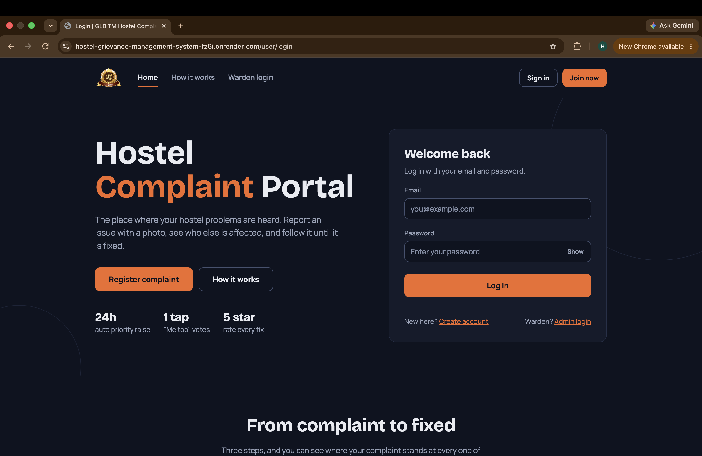
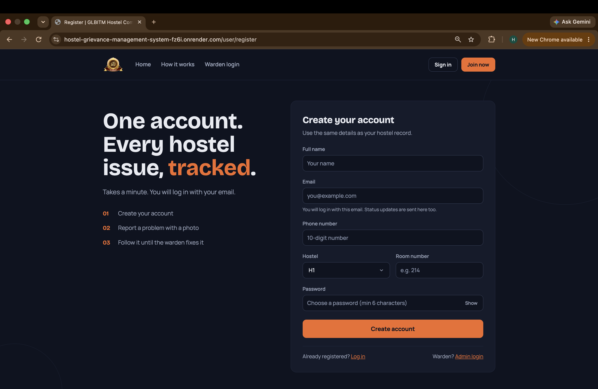
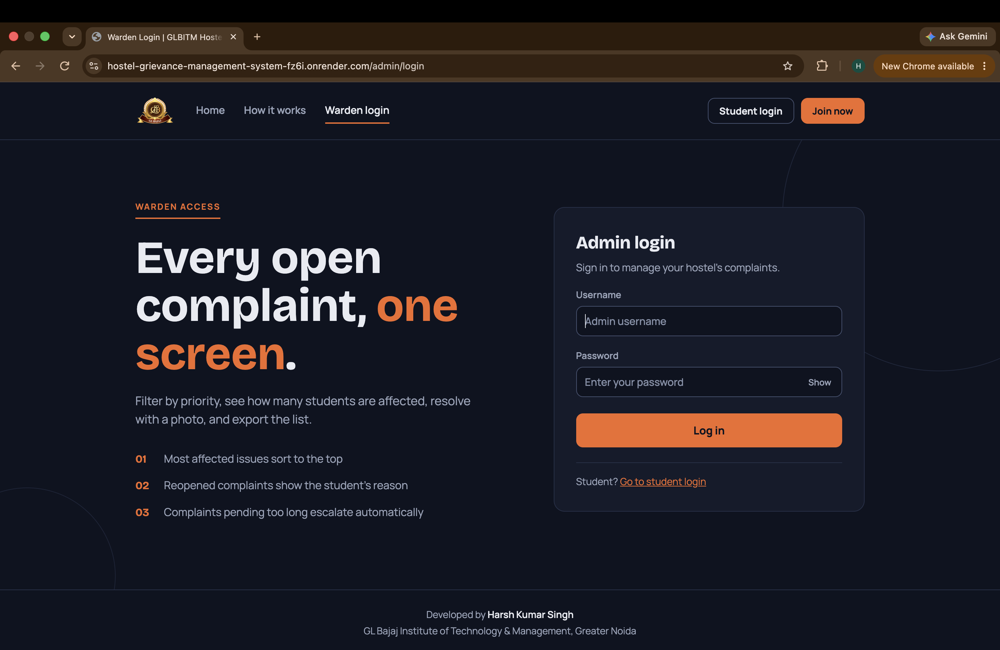
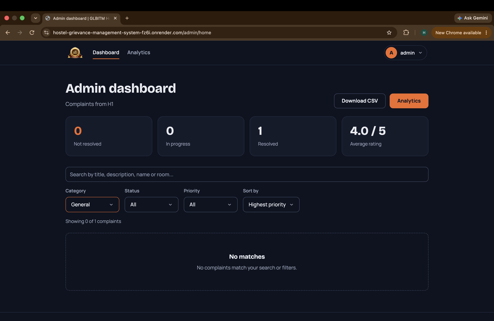
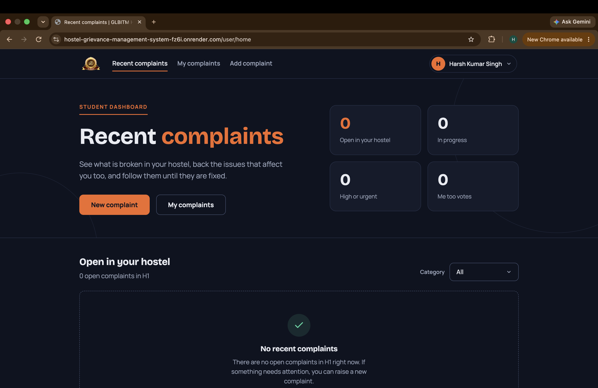
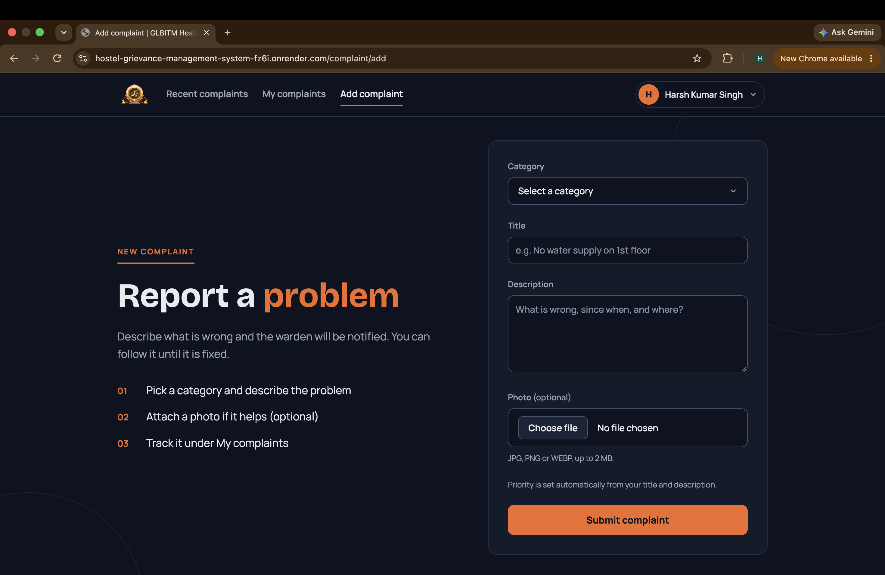

# GLBITM Hostel Complaint Portal 🏢

A web-based complaint management system customized for the hostels of **GL Bajaj Institute of Technology & Management, Greater Noida**. Students can report hostel issues, and wardens can track, manage, and resolve them, with priorities, auto-escalation, email alerts and analytics.

## 🌐 Live Demo

**https://hostel-grievance-management-system-fz6i.onrender.com**

> The app runs on a free hosting plan, so the first load after a period of inactivity can take 30 to 60 seconds. Please wait for the page to wake up.

---

## 📸 Screenshots

### GLBITM Hostel Complaint Portal



### Create Account



### Admin Login



### Admin Dashboard



### Student Dashboard



### Add Complaint



---

## ✨ Features

This portal provides distinct functionalities for students and administrators to ensure a smooth complaint resolution process.

### For Students 🧑‍🎓

* **Secure Registration & Login:** Register with email, phone, hostel (H1 to H4), room number and password. Log in with email and password.
* **Raise Complaints:** Report problems across predefined categories:
    * 💧 Water
    * 💡 Electricity
    * 🌐 Network / Wi-Fi
    * 🍲 Mess / Canteen
    * 🚻 Washrooms
    * 🛠️ General Maintenance
* **Photo Upload:** Attach an optional photo (JPG, PNG or WEBP, up to 2 MB) stored on Cloudinary.
* **Automatic Priority:** Every complaint gets a priority (Urgent, High, Medium, Low) when it is created.
* **Recent Complaints & "Me too" Votes:** See recent complaints from your own hostel and back the same issue with one tap, so the warden can see how many students are affected.
* **My Complaints:** Search, filter (category, status, priority) and sort all complaints you have submitted.
* **Mark as Resolved:** Close the loop once the issue is fixed.
* **Rate the Fix:** Give a 1 to 5 star rating after a complaint is resolved.
* **Reopen:** Use "Problem still exists" with a reason if the issue comes back. A reopen counter is shown on the complaint.
* **Email Notifications:** Get an email when your complaint is received, updated, resolved or reopened.

### For Admins (Wardens) 👨‍💼

* **Admin Login:** Secure login for hostel wardens, with bcrypt password hashing.
* **Hostel-Scoped Dashboard:** Each warden sees only the complaints of their own hostel, with live stat tiles.
* **Filters & Sorting:** Filter by category, status and priority, and use "Most affected" sort to see issues that hit the most students first.
* **Update Panel:** Change status and priority, add an admin note, and upload a resolution photo ("after" image).
* **Quick Resolve:** Mark a complaint as resolved in one click.
* **CSV Export:** Download the currently filtered list as a CSV file.
* **Analytics Dashboard:** Charts for complaint trends, categories, status, priority and more, with a selectable time period.
* **Auto-Escalation:** If a complaint stays unresolved for 24 hours, its priority is raised one level (unless the admin set it manually). After 48 hours, the warden gets a reminder email.
* **Email Alerts:** New complaint, resolved, reopened and reminder emails.

### Security 🔒

* Helmet security headers, rate limiting on login and registration
* CSRF protection (Sec-Fetch-Site and Origin/Referer check)
* JWT in `httpOnly`, `sameSite=strict` cookies (`secure` in production)
* Escaping of all user text to prevent XSS
* Image type and size validation

---

## 🛠️ Tech Stack

| Technology            | Usage                                  |
| --------------------- | -------------------------------------- |
| **Node.js**           | Backend Runtime                        |
| **Express.js 5**      | Web Framework                          |
| **MongoDB Atlas**     | Cloud Database                         |
| **Mongoose**          | ODM for MongoDB                        |
| **EJS**               | Server-Side Rendering                  |
| **JavaScript**        | Application Logic                      |
| **HTML/CSS**          | Frontend UI (custom dark theme)        |
| **Chart.js**          | Admin analytics charts                 |
| **JWT & bcrypt**      | Authentication and password hashing    |
| **Multer**            | Image upload handling                  |
| **Cloudinary**        | Photo storage                          |
| **Brevo (HTTP API)**  | Transactional emails                   |
| **node-cron**         | Hourly auto-escalation job             |
| **Render**            | Hosting                                |
| **Git & GitHub**      | Version Control                        |

## ⚙️ Architecture

* MVC-inspired project structure with modular routes, controllers, and middleware
* Express.js based backend server
* MongoDB database integration using Mongoose (MongoDB Atlas)
* JWT-based authentication and authorization
* Photos are uploaded to Cloudinary, only the image URL is stored in the database
* Emails are sent through Brevo's HTTP API (hosting platforms often block SMTP ports)
* Complaint management workflow for students and administrators

---

## 🚀 Getting Started

To get a local copy up and running, follow these steps.

### Prerequisites

Make sure you have the following installed on your machine:

* [Node.js](https://nodejs.org/en/) (includes npm)
* A MongoDB database ([MongoDB Atlas](https://www.mongodb.com/atlas) free tier or local [MongoDB](https://www.mongodb.com/try/download/community))
* [Git](https://git-scm.com/)
* Optional: a free [Cloudinary](https://cloudinary.com/) account (photo upload) and a free [Brevo](https://www.brevo.com/) account (emails)

### Installation

1. **Clone the repository**

```sh
   git clone https://github.com/singhharsh006/Hostel-Grievance-Management-System.git
```

2. **Navigate to the project directory**

```sh
   cd Hostel-Grievance-Management-System
```

3. **Install NPM packages**

```sh
   npm install
```

4. **Create an environment file**

   Create a `.env` file in the root directory and add the following variables:

```env
   MONGODB_URI=your_mongodb_connection_string
   PORT=1080
   JWT_SECRET=a_strong_and_long_random_secret_string
   JWT_EXPIRES_IN=1d
   ADMIN_EMAIL=warden_email_for_alerts

   # Photo upload (optional, complaints work without photos)
   CLOUDINARY_CLOUD_NAME=your_cloud_name
   CLOUDINARY_API_KEY=your_api_key
   CLOUDINARY_API_SECRET=your_api_secret

   # Emails (optional, emails are skipped if these are missing)
   BREVO_API_KEY=your_brevo_api_key
   MAIL_FROM=your_verified_brevo_sender_email
```

   Never commit your `.env` file. It is already listed in `.gitignore`.

5. **Start the server**

```sh
   npm start
```

   For development with auto-restart, use `npm run dev`.
   The application will be running at `http://localhost:1080`.

### Deployment

The live demo is deployed on Render with MongoDB Atlas. Set the same environment variables in the Render dashboard, add `NODE_ENV=production`, and allow Render in the MongoDB Atlas network access list.

### Creating an Admin Account

Students register from the registration page, but admin accounts are created directly in the database. Add a document to the `adminusers` collection with these fields:

| Field       | Description                                           |
| ----------- | ----------------------------------------------------- |
| `username`  | Admin login username                                  |
| `password`  | Admin login password (hashed with bcrypt automatically on first login) |
| `hostel_no` | Must match the hostel number students use (e.g. `H1`) |
| `type`      | `admin`                                               |

The admin dashboard shows complaints of the admin's own hostel only, so `hostel_no` must match the students' hostel number.

---

## 👨‍💻 Developer

**Harsh Kumar Singh**
B.Tech Computer Science Engineering
GL Bajaj Institute of Technology & Management, Greater Noida

GitHub: https://github.com/singhharsh006

**Features I added to the original project:** complete dark-theme UI redesign, priority system with auto-escalation, "Me too" votes, ratings and reopen flow, photo upload with Cloudinary, CSV export, admin analytics dashboard, email notifications through Brevo, security hardening, and cloud deployment.

Based on the open-source MANIT Hostel Complaint Portal by Ravi Prakash,
used under the GNU GPL v3.0. See the `LICENSE` file.

## 📄 License

This project is distributed under the GNU General Public License v3.0.
See the `LICENSE` file for complete license terms.